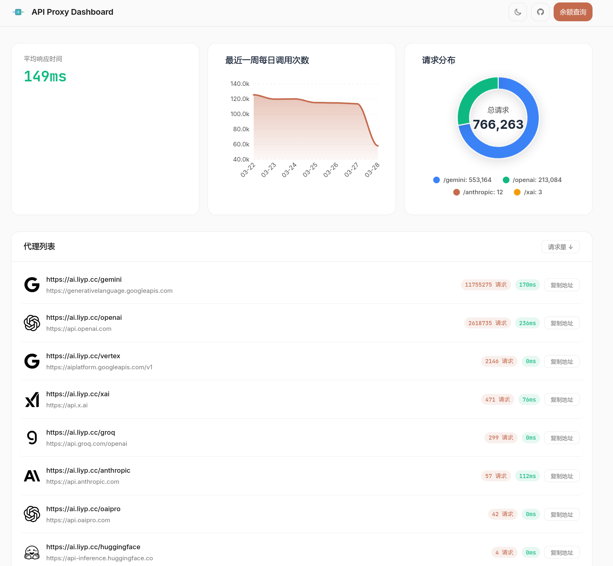
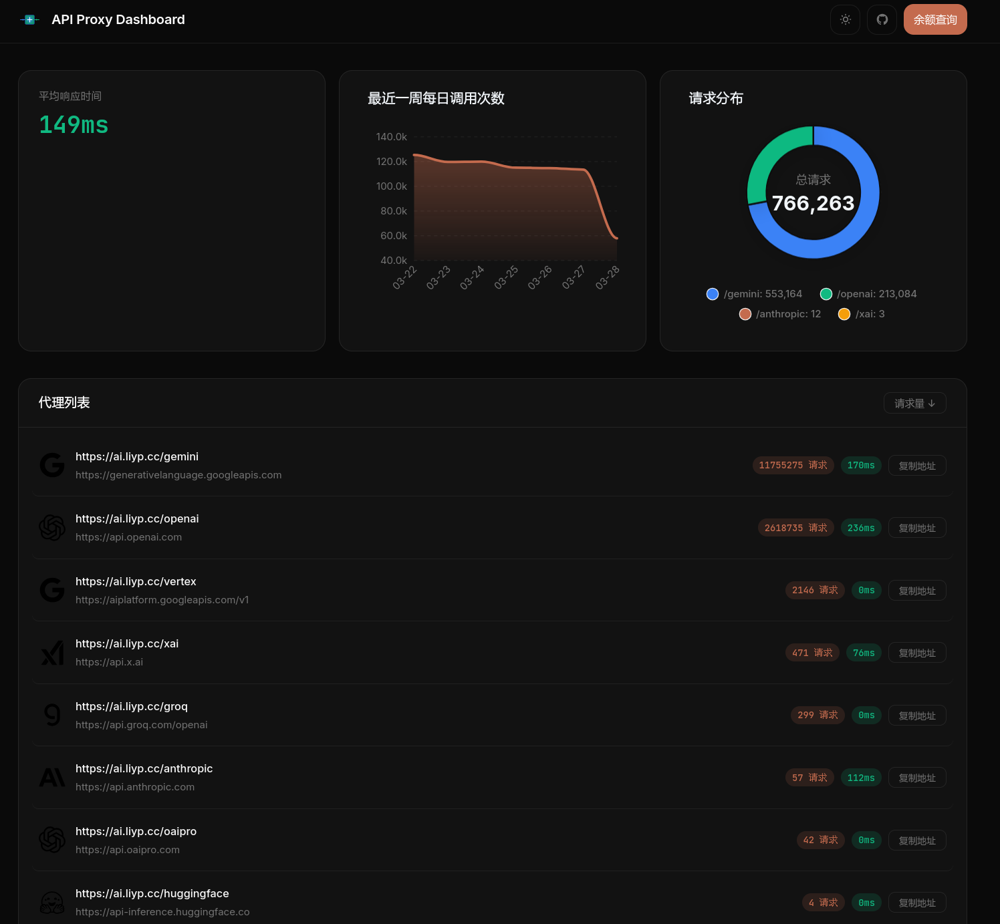
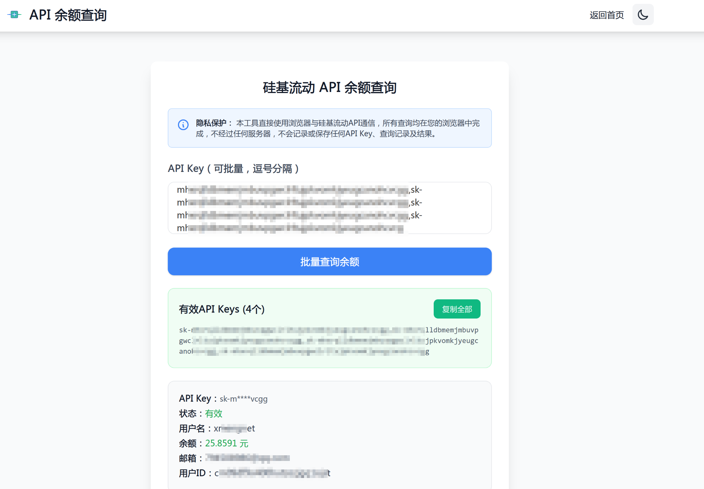

# Go Proxy - AI 服务代理工具

一个轻量级的 HTTP 代理服务器，专为解决 AI 服务访问问题设计。支持多路由代理、请求统计和美观的数据可视化界面。

[](https://github.com/xmengnet/go-proxy/actions/workflows/docker-publish.yml)

## 核心特性

- 🚀 **多路由代理**: 通过 YAML/JSON 配置多个代理规则
- 📊 **数据统计**: 实时监控请求次数、响应时间等指标
- 💰 **成本追踪**: 统计 API 调用成本
- 🎨 **现代界面**: 响应式设计 + 暗色模式
- 🔄 **余额查询**: 支持硅基流动 API 余额查询
- 🐳 **容器支持**: 提供 Docker 镜像，支持 Docker Compose 部署

## 界面预览

### 主界面



### API 余额查询界面



## 快速开始

### Docker 运行

```bash
# 拉取镜像
docker pull xmengnet/go-proxy

# 运行容器
docker run -d \
  -p 8080:8080 \
  -v $PWD/data:/app/data \
  --name go-proxy \
  xmengnet/go-proxy
  
 # 注意需要 data 目录下有配置文件
```

### 源码运行

```bash
# 克隆项目
git clone https://github.com/xmengnet/go-proxy.git
cd go-proxy

# 安装依赖
go mod tidy

# 运行
go run main.go
```

## 配置说明

创建 `data/config.yaml` 文件：

```yaml
server:
  port: "8080"  # 服务器端口
proxies:
  - path: "/gemini"  # 匹配路径
    target: "https://generativelanguage.googleapis.com"  # 目标地址
    vendor: "google"        # 厂商标识
  - path: "/anthropic"
    target: "https://api.anthropic.com"
    vendor: "anthropic"     
```

## 构建与运行

1.  **克隆项目**:
    ```bash
    git clone https://github.com/xmengnet/go-proxy.git
    cd go-proxy
    ```
2.  **安装依赖**:
    ```bash
    go mod tidy
    ```
3.  **配置**:
    编辑 `data/config.yaml` 文件，配置代理规则。示例配置如下：

    ```yaml
    server:
      port: 8070

    proxies:
      - path: "/gemini"         # 代理路径
        target: "https://generativelanguage.googleapis.com"  # 目标地址
        vendor: "google"        # 厂商标识

      - path: "/anthropic"
        target: "https://api.anthropic.com"
        vendor: "anthropic"
    ```

## 容器镜像

- GitHub Container Registry: `ghcr.io/xmengnet/go-proxy`
- Docker Hub: `xmengnet/go-proxy`

支持的标签格式：
- `vX.Y.Z`: 具体版本
- `X.Y`: 主次版本
- `latest`: 最新版本

## 配置文件

配置文件支持 YAML 和 JSON 两种格式，包含以下配置项：
    *   `path`: 匹配的请求路径前缀。
    *   `target`: 请求将被转发到的目标地址。
    *   `vendor`: （可选）AI 服务提供商标识，用于显示对应的图标。支持的值包括：
        *   `google`: Google (Gemini)
        *   `anthropic`: Anthropic
        *   `openai`: OpenAI
        *   `groq`: Groq
        *   `huggingface`: Hugging Face
        *   `x`: xAI

示例配置（YAML 格式）：
```yaml
server:
  port: "8080"
  retention_days: 90  # 可选，数据保留天数，不填默认90天
proxies:
  - path: "/gemini"
    target: "https://generativelanguage.googleapis.com"
    vendor: "google"
  - path: "/openai"
    target: "https://api.openai.com"
    vendor: "openai"
```

## Web 界面

启动服务器后，访问 `http://localhost:<端口号>/` (替换 `<端口号>` 为配置文件中指定的端口) 即可访问 Web 界面，查看代理规则和实时统计数据。

## 依赖

*   [Echo](https://github.com/labstack/echo): 高性能、可扩展、低内存占用的 Go Web 框架。
*   [go-sqlite3](https://github.com/mattn/go-sqlite3): SQLite 驱动。

## 部署到 Vercel

本项目也可以部署到 Vercel 作为无服务器函数。在 Vercel 环境中，统计功能（数据库和统计中间件）将被禁用，`/api/stats` 接口将只返回代理节点信息（不包含请求次数）。

### Vercel 配置

在 Vercel 项目设置中，需要配置 `PROXIES_CONFIG` 环境变量来定义代理规则。

*   `PROXIES_CONFIG`: 包含一个 JSON 数组的字符串，其中每个元素是一个代理配置对象。格式类似于 `data/config-sample.json` 文件中的 `proxies` 数组部分。

    示例 `PROXIES_CONFIG` 环境变量值：
    ```json
    [
      {"path":"/gemini","target":"https://generativelanguage.googleapis.com"},
      {"path":"/google","target":"https://www.google.com"}
    ]
    ```

### 注意事项

*   由于 Vercel 无服务器环境的限制，数据库和请求统计功能不可用。
*   `/api/stats` 接口在 Vercel 环境下仅返回代理节点的 `path` 和 `target` 信息，`access_count` 将固定为 0。
*   请注意，Vercel 由于不支持 go 语言的 Flush() 函数，导致流式输出不可用，因此不建议使用 Vercel 部署。

## 部署到 Render

可以将本项目部署为 Render 的 Web Service。

### 构建和部署

1.  在 Render 控制台创建一个新的 Web Service。
2.  连接你的 Git 仓库。
3.  配置构建命令 (Build Command)，例如 `go build -o go-proxy main.go`。
4.  配置启动命令 (Start Command)，例如 `./go-proxy`.
5.  配置环境变量同 Vercel 配置。

### 配置

可以通过以下方式配置代理规则：

1.  **使用 `data/config.yaml`**: 如果将 `data` 目录及其内容包含在部署中，项目将读取 `data/config.yaml` 文件。这是推荐的方式，与本地运行一致。
2.  **使用环境变量**: 所有部署方式都支持设置环境变量。你可以通过环境变量来配置需要代理的连接，但是需要 JSON 格式，可以参照 `config/config-sample.json` 配置。


## 许可证

本项目采用 [MIT 许可证](LICENSE)。
